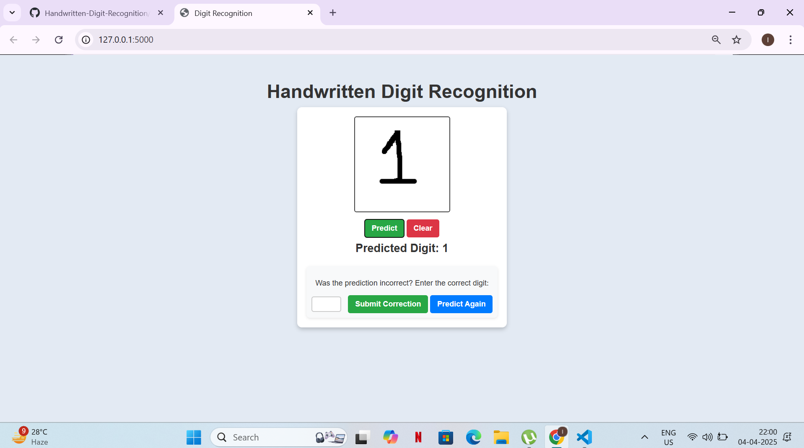

# Handwritten Digit Recognition  

## Overview  
This is a web-based Handwritten Digit Recognition system that allows users to draw digits (0–9) on a canvas and predicts them using a Convolutional Neural Network (CNN). The model is trained on the MNIST dataset and can improve over time through user feedback.  

## Features  
- **Digit Prediction**: Users can draw digits (0–9) on a canvas, and the system predicts them in real time.  
- **Correction & Learning**: Users can correct wrong predictions, and the model learns from them.  
- **Retraining Mechanism**: The model retrains itself dynamically using corrected images.  
- **Interactive Web UI**: Built using HTML, CSS, and JavaScript (Canvas API) for smooth interaction.  
- **Deep Learning Model**: Utilizes PyTorch and CNN for digit recognition.  

## Frontend Preview  
  

## Tech Stack  
- **Frontend**: HTML, CSS, JavaScript (Canvas API)  
- **Backend**: Flask (Python)  
- **Machine Learning**: PyTorch, Convolutional Neural Network (CNN)  
- **Dataset**: MNIST (Modified National Institute of Standards and Technology)  
- **Deployment**: Localhost (can be extended to cloud platforms)  

## Installation & Setup  

### 1. Clone the Repository  
```bash
git clone https://github.com/D3vn4/HandwrittenDigitRecognition.git
cd HandwrittenDigitRecognition

### 2. Create a Virtual Environment 
```bash
python -m venv venv
source venv/bin/activate 

### 3. Run the Application
```bash
python app.py

### 4. Open in Browser
```bash
Go to http://127.0.0.1:5000 in your web browser.


